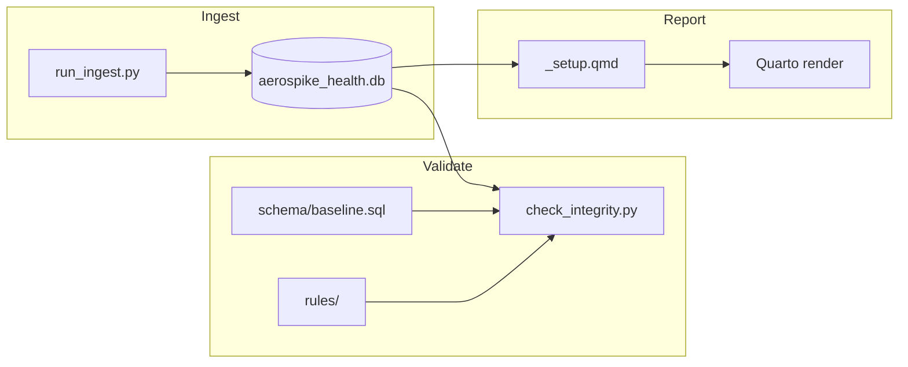

# Aerospike Health Analyzer (v2.0.1)

This project lives at **citrusleaf/tam-tools/tam-flash-report**. Report title: *Aerospike Health and Performance Report*.

A universal diagnostic framework for Aerospike clusters, providing native support for **6.x, 7.x, and 8.x** Enterprise editions. It ingests `collectinfo` telemetry into a relational SQLite database, executes a version-aware rule engine, and generates modular Quarto HTML reports.

---

## Architecture & Design

The tool operates as a decoupled data pipeline:

1. **Ingestion Layer (`ingest/`)**: The DB is created from the canonical schema (`schema/baseline.sql`) at ingest init; ingestors only insert. They flatten hierarchical telemetry into relational tables and normalize version-specific metrics (e.g. 6.x/7.x namespace stats) for rules and the report.
2. **Logic Layer (`rules/`)**: Independent Python modules that perform version-aware anomaly detection against the fixed schema.
3. **Presentation Layer (`report_components/`)**: A modular Quarto-based UI that adapts visualizations based on available data.



The *Validate* step is for development and debugging; end users only run *Ingest* and *Report*.

---

## Prerequisites & Installation

### Local Environment Requirements
* **Python 3.10 - 3.13**: The core engine utilizes modern Python features and type hinting.
* **Quarto CLI**: Required for rendering the interactive HTML report. [Download Quarto](https://quarto.org/docs/get-started/)
* **Aerospike Admin (asadm)**: Necessary for collecting the telemetry bundles (`.tgz`) from target clusters.

### Setup
Clone the parent repo and work from the **tam-flash-report** directory (project root for all commands below). Create and activate a virtual environment (recommended):

```bash
git clone https://github.com/citrusleaf/tam-tools.git
cd tam-tools/tam-flash-report

# Create venv and install dependencies (pandas, plotly, jupyter, pyyaml)
./setup_venv.sh

# Activate the venv before running any commands below
source .venv/bin/activate
```

Dependencies include **pandas**, **plotly**, **jupyter**, and **pyyaml** (required for `quarto render report.qmd`). SQLite is provided by the Python standard library.

---

## Directory Structure

Paths below are relative to the project root (`tam-flash-report/`).

```text
tam-flash-report/
├── MANIFEST.md           # Project scope, requirements, backlog
├── run_ingest.py         # Ingestion entry point
├── ingest_manager.py     # Applies schema/baseline.sql, runs ingestors per node
├── check_integrity.py    # Validates DB schema against schema/baseline.sql, then runs rules
├── setup_venv.sh         # Venv creation and dependency install
├── schema/               # Canonical SQLite DDL
│   └── baseline.sql
├── docs/                 # Schema and version-path documentation
│   ├── schema.md
│   ├── telemetry-version-path-matrix.md
│   ├── testing.md       # E2E and rules report
│   ├── report-issues.md # Report clarity/accuracy backlog
│   └── samples/
├── tests/                # E2E wrapper
│   └── run_e2e.py       # Ingest + integrity in one command
├── ingest/               # Telemetry parsers (one table per module)
├── rules/                # Diagnostic logic library
├── report_components/   # Modular UI partials
├── ingest_samples/       # Optional: sample collectinfo bundles (6.x, 7.x, 8.x)
├── inspect_collectinfo_bundles.py  # Optional: inspect bundle structure
├── report.qmd
├── _setup.qmd
├── commit_baseline.py
└── set_version.py
```

---

## Usage

Activate the venv first (`source .venv/bin/activate`), then:

### 1. Ingest Telemetry
Ingests an Aerospike `collectinfo` bundle. The DB is recreated from `schema/baseline.sql` on each run; the previous database is replaced automatically.

```bash
python3 run_ingest.py path/to/your_bundle.tgz
# Example with sample bundles:
# python3 run_ingest.py ingest_samples/collect_info_v7x/adobe-azure-els.collect_info_20260120_225608.tgz
```

### 2. Render the Report

```bash
quarto render report.qmd
```

---

## Development

For maintainers and contributors:

- **Validate DB and run rules** (e.g. before changing code or releasing):  
  `python3 check_integrity.py` — validates that the live DB schema matches `schema/baseline.sql`, then runs all rules.
- **E2E (ingest + integrity, no report):**  
  `python3 tests/run_e2e.py <bundle.tgz>`. Optional: set `AEROSPIKE_E2E_BUNDLE` to a fixture path and run `python3 tests/run_e2e.py`. See [docs/testing.md](docs/testing.md).
- **Maintain the baseline** (version and schema):  
  `python3 set_version.py` and `python3 commit_baseline.py` when releasing or updating the canonical schema.

---

## Documentation

* **[MANIFEST.md](MANIFEST.md)** — Project scope, requirements (fixed schema, aerospike.conf in bundle, ingest tagging), and backlog.
* **[docs/schema.md](docs/schema.md)** — SQLite table and column reference.
* **[docs/telemetry-version-path-matrix.md](docs/telemetry-version-path-matrix.md)** — Collectinfo JSON path → table mapping for 6.x, 7.x, and 8.x.

When the collectinfo bundle includes **aerospike.conf**, it is parsed and ingested into the `static_configs` table for the Config Drift rule (see [docs/schema.md](docs/schema.md)#static_configs). If the file is missing, that rule reports DATA MISSING.

---

**Version:** 2.0.1 | **Target Support:** Aerospike 6.x, 7.x, 8.x Enterprise | **Maintainer:** TAM Team